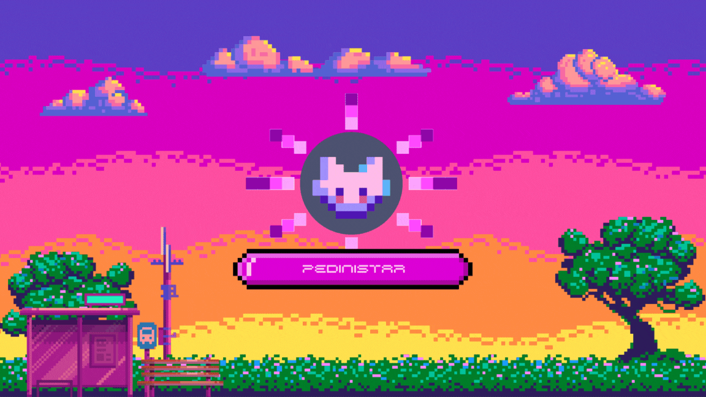

<h1 align="center">Namaste 🙏, I'm Pedini Jayashree</h1>
<h3 align="center">A passionate Python Developer from India.</h3>

  

  

<h2 align="left">👩‍💻 About Me</h2>

  Hey there! I'm Pedini Jayashree, a passionate developer exploring and learning about Python and web animation.

<h2 align="left">🔍 Currently Exploring</h2>

Python, Web Animation (GSAP)

<h2 align="left">🌱 Skills</h2>

Python 🐍 | HTML | CSS | JavaScript

<h2 align="left">📫 Connect with Me</h2>

Let's chat about code, and connect on <a href="https://www.linkedin.com/in/pedini-jayashree/">LinkedIn 🌟</a>

<h3 align="left">Connect with Me</h3>

  
  

<h3 align="left">Languages and Tools</h3>

  
  
  
  
  
  
  
  

